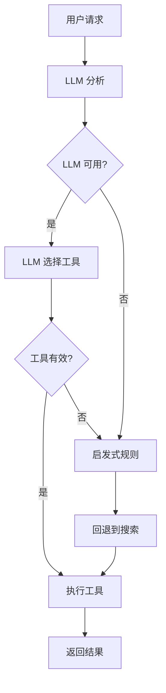

# AI 应用开发中的工具选择方法

## 🚫 传统方法的问题

### 1. 硬编码关键词匹配
```python
# ❌ 不够灵活的方式
if any(keyword in task for keyword in ['天气', 'weather']):
    selected_tool = "get_weather"
```

**问题：**
- 无法处理同义词或变体表达
- 难以理解上下文和意图
- 维护成本高，需要不断添加关键词
- 无法处理复杂的多步骤任务

## ✅ 现代 AI 应用开发方法

### 1. **LLM Native Function Calling**
让 LLM 自己决定调用哪个工具，这是目前最主流的方法：

```python
# ✅ 现代方式：LLM 智能选择
prompt = f"""
用户请求："{user_message}"

可用工具：
- web_search(query: str): 网络搜索
- calculate(expression: str): 数学计算
- get_weather(city: str): 天气查询

请选择最合适的工具并确定参数。
返回JSON格式：{"selected_tool": "工具名", "tool_args": {...}}
"""
```

### 2. **工具描述驱动选择**
通过详细的工具描述让 LLM 理解每个工具的用途：

```python
tools_schema = [
    {
        "name": "web_search",
        "description": "搜索互联网信息，适用于查找最新资讯、了解概念、获取实时数据",
        "parameters": {
            "query": {"type": "string", "description": "搜索关键词"}
        }
    },
    # ... 其他工具
]
```

### 3. **多层决策架构**
- **第一层**: LLM 智能选择（主要方法）
- **第二层**: 改进的启发式规则（回退方案）
- **第三层**: 默认行为（最后保底）

## 🔄 现代工具选择流程



## 🏢 实际应用案例

### OpenAI GPTs
```python
# OpenAI 的 function calling
functions = [
    {
        "name": "get_weather",
        "description": "Get weather information for a city",
        "parameters": {
            "type": "object",
            "properties": {
                "city": {"type": "string"}
            }
        }
    }
]

response = openai.ChatCompletion.create(
    model="gpt-4",
    messages=[{"role": "user", "content": "北京天气怎么样？"}],
    functions=functions,
    function_call="auto"  # 让 GPT 自己决定
)
```

### LangChain Agents
```python
# LangChain 的 agent 模式
from langchain.agents import create_openai_functions_agent

agent = create_openai_functions_agent(
    llm=llm,
    tools=tools,
    prompt=prompt_template
)
```

### Claude/Anthropic
```python
# Claude 的工具使用
tools = [
    {
        "name": "calculator",
        "description": "Perform mathematical calculations",
        "input_schema": {
            "type": "object",
            "properties": {
                "expression": {"type": "string"}
            }
        }
    }
]
```

## 🎯 最佳实践

### 1. **工具描述要详细**
```python
# ❌ 描述太简单
"description": "计算工具"

# ✅ 描述详细清楚
"description": "执行数学计算，支持基本算术运算(+,-,*,/)、幂运算、三角函数、对数等。输入数学表达式，返回计算结果。"
```

### 2. **提供示例**
```python
"description": "翻译文本到目标语言",
"examples": [
    {"input": "Hello", "target": "zh", "output": "你好"},
    {"input": "Bonjour", "target": "en", "output": "Hello"}
]
```

### 3. **错误处理和回退**
```python
try:
    # 尝试 LLM 选择
    tool_choice = llm_select_tool(user_input)
except Exception:
    # 回退到启发式规则
    tool_choice = heuristic_select_tool(user_input)
```

### 4. **工具组合和链式调用**
```python
# 现代应用支持多工具协作
plan = [
    {"tool": "web_search", "args": {"query": "北京天气"}},
    {"tool": "analyze_data", "args": {"data": "weather_results"}},
    {"tool": "translate_text", "args": {"text": "analysis", "target": "en"}}
]
```

## 🚀 未来趋势

1. **多模态工具选择**: 结合文本、图像、语音
2. **自适应学习**: 根据用户习惯调整工具选择
3. **工具组合优化**: AI 自动规划最优工具序列
4. **实时工具发现**: 动态发现和集成新工具

## 📊 性能对比

| 方法 | 准确率 | 灵活性 | 维护成本 | 适用场景 |
|------|--------|--------|----------|----------|
| 关键词匹配 | 60% | 低 | 高 | 简单应用 |
| LLM Function Calling | 90%+ | 高 | 低 | 现代应用 |
| 混合方法 | 95% | 高 | 中 | 生产环境 |

现代 AI 应用开发已经从硬编码规则转向了 LLM 驱动的智能决策，这让系统更加灵活、准确和易于维护。 